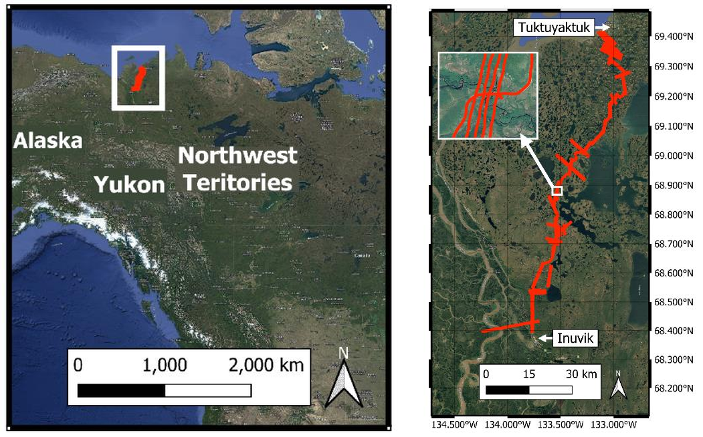
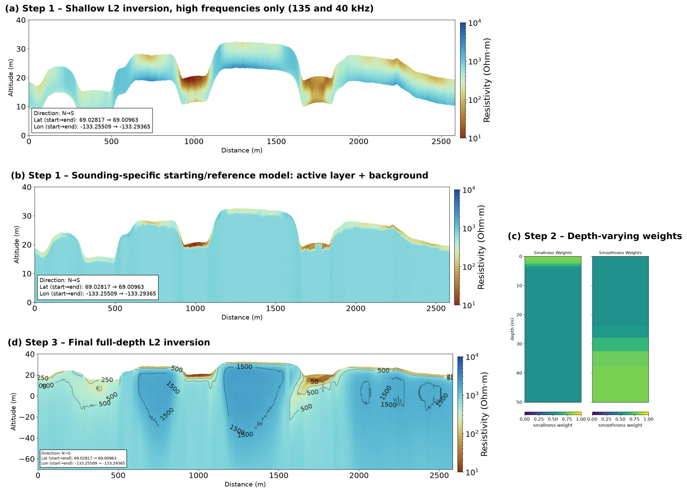
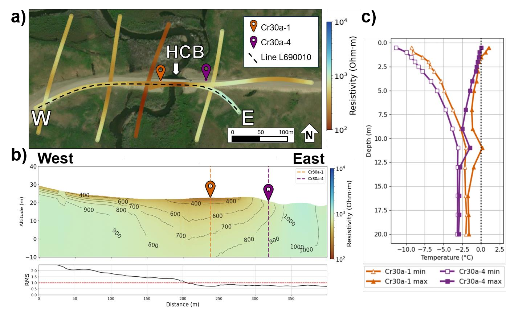
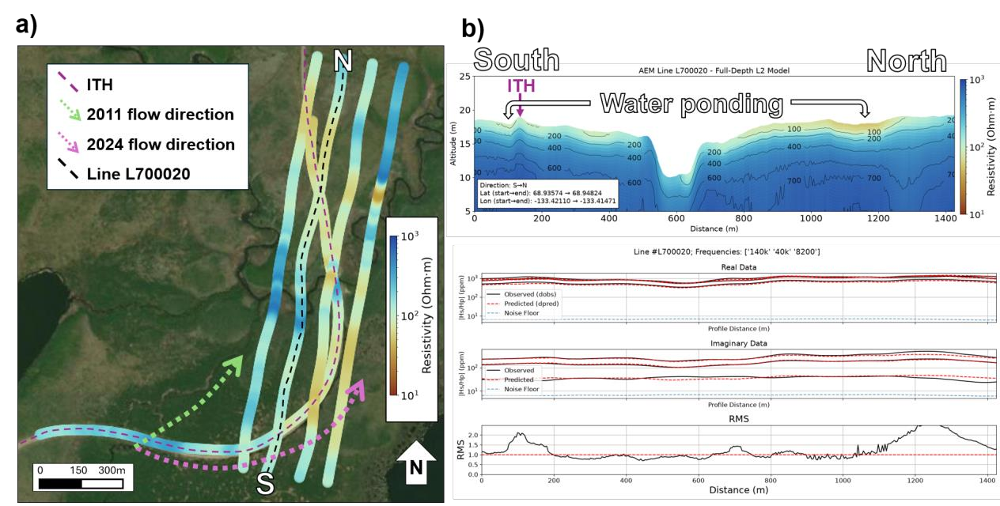

## Introduction

The northern Northwest Territories in the Canadian Arctic contain some of the most ice-rich permafrost landscapes in North America (Kokelj et al., 2023). As climate change drives rising ground temperatures, accelerating permafrost degradation is affecting ecosystems and infrastructure across the region. This project focuses on the Inuvik–Tuktoyaktuk Highway (ITH), a 138 km all-season road in the Northwest Territories that opened in 2017 as the first Canadian highway to reach the Arctic Ocean (Sladen et al., 2022). The ITH traverses continuous permafrost and complex environmental conditions, and plays a critical role in providing access to healthcare, education, and economic opportunities for northern communities. As permafrost degradation increasingly threatens the corridor's stability, sustained monitoring and characterization of subsurface conditions are essential for resilient infrastructure planning. Beyond local impacts, permafrost degradation is also critical because it amplifies Arctic climate feedback (Schuur et al., 2015). To address these challenges, an airborne frequency-domain electromagnetic (AEM) survey was conducted along the ITH in 2024, the longest survey of its kind for continuous permafrost applications. AEM provides a spatially extensive, time-efficient, and cost-effective alternative to traditional methods for regional permafrost characterization. Beyond our AEM-derived subsurface resistivity models, this project validates the results against traditional field measurements and uses surficial geology and remote sensing datasets to support model interpretation and infrastructure hazard assessments. Results from the Hans Creek Bridge (HCB) and Zed Creek (ZC) study sites illustrate the project approach and its applications.

## Method

**Figure 1:** *Airborne electromagnetic (AEM) survey lines acquired along the Inuvik–Tuktoyaktuk Highway (ITH) corridor in the Northwest Territories, Canada, highlighting the Hans Creek Bridge and Zed Creek areas of interest.*

The AEM survey (Figure 1) was flown in August 2024 with the RESOLVE frequency-domain electromagnetic system, operated by Xcalibur Multiphysics. The system records six frequencies: five in coplanar orientation (135 kHz, 40 kHz, 8.2 kHz, 1.8 kHz and 400 Hz) and one in coaxial orientation (3.3 kHz). In total, 1,142 line-kilometres were flown along the ITH, with 100 m line spacing and an average terrain clearance of 35 m. We inverted the data with the open-source SimPEG framework (Cockett et al., 2015) to recover subsurface resistivity models. Given the survey scale, we built quasi-2D models for each flight line by stitching together individual 1D inversions.

Two aspects of the data shaped the inversion workflow. First, in this resistive, continuous-permafrost setting, the lowest-frequency responses often fall below the noise floor or become negative, particularly at higher latitudes and across abrupt conductive-to-resistive transitions. The high-frequency data, in contrast, are more consistent and usable. Second, forward simulations showed that changes in a ~1 m active layer influence the AEM response as strongly as variations in deeper ice content. An initial approach that used a single mean half-space as the reference model performed poorly under these conditions. It biased the results toward deeper structure, stretching shallow features to greater depths and introducing deep structures not expected in this Arctic setting. It also struggled where lateral resistivity contrasts were strong. Because the deeper structure is expected to vary little and the low-frequency data are not always usable, we developed a shallow-focused workflow in three steps (Figure 2).

First, we build a starting and reference model for each sounding. A shallow L2 inversion of only the two highest frequencies (135 and 40 kHz) defines the active layer: its thickness is set at the depth of the maximum vertical resistivity gradient, and its resistivity is the average resistivity above that depth. A one-layer half-space inversion of the lowest usable frequency, run on selected soundings, provides the background resistivity for the bottom layer. Second, the regularization weights vary with depth: smallness is weighted strongly near the surface to keep the model close to the shallow reference, and smoothness is enforced more strongly below ~30 m, where sensitivity is low. Third, a full-depth L2 inversion is run with these weights and the sounding-specific starting and reference models. The resulting models better define water bodies and shallow structures and produce smoother deep layers without artifacts. The workflow can also be applied consistently from highly resistive to more conductive settings without tuning each section.

**Figure 2:** *Inversion workflow along Line L740010: (a) high-frequency shallow inversion; (b) sounding-specific starting/reference model (active layer + background); (c) depth-varying smallness and smoothness weights; (d) final full-depth inversion.*

To validate and corroborate the AEM-derived models, we use ground-based datasets, including Electrical Resistivity Tomography (ERT) profiles, borehole data and ground temperature measurements. Remote sensing datasets, such as satellite imagery and Interferometric Synthetic Aperture Radar (InSAR) products from public sources, could also provide near-surface constraints.

## Hans Creek Bridge

Bridges along the ITH are particularly vulnerable to ground hazards because they concentrate thermal disturbances. This study focuses on the Hans Creek Bridge (HCB) at km 57.3, which is founded on adfreeze pile foundations that require ground temperatures below −1 °C to maintain structural stability (Siemens & Schetselaar, 2026). Pre-construction data showed that the HCB had the highest ground temperatures at the base of the pier among all ITH bridge locations (Hoeve, 2023), making it a critical site for subsurface monitoring. Several temperature-monitoring boreholes installed by the Northwest Territories Geological Survey (NTGS) exist at the site. However, the dataset contains temporal gaps and limited spatial coverage due to the challenges of traditional borehole monitoring. We use these data here to compare with the AEM-derived results.

**Figure 3:** *Hans Creek Bridge (HCB) Region: (a) Shallow subsurface resistivity (~2.25 m depth) derived from AEM flight line inversions; (b) subsurface resistivity cross-section along Line L690010; and (c) borehole temperature profiles from NTGS boreholes Cr30a-1 and Cr30a-4 (2021-12-09 to 2022-06-02).*

As shown in Figure 3a, the subsurface resistivity slice at 2.25 m depth reveals a clear contrast, with lower resistivity values on the west side of the bridge compared to the east side. This contrast is also observed in the cross section along Line "L690010" in Figure 3b. The western side of the HCB exhibits lower shallow (<5 m) resistivity values (~500 Ω·m), indicative of warmer permafrost conditions with higher unfrozen water content, whereas the eastern side shows higher shallow resistivity values (~750–1000 Ω·m) associated with colder, more ice-rich permafrost. Borehole temperature data from the HCB abutments (Figure 3c) indicate that the western borehole (Cr30a-4) is approximately 1–2 °C warmer than the eastern borehole (Cr30a-1), consistent with the resistivity contrasts observed in Figures 3a and 3b. Despite the temporal gap between the borehole records (December 2021–June 2022) and the AEM survey (August 2024), these thermal contrasts are expected to persist and potentially intensify over time, particularly during the summer thaw season. Overall, the agreement between the AEM models and the borehole data at the HCB highlights the value of AEM as a complementary approach to borehole monitoring, especially where priority areas for mitigation are not clearly defined and borehole observations remain spatially limited.

## Zed Creek

The Zed Creek (ZC) area is another major region of interest located at km 67–68 along the ITH. Unlike the HCB site, this area has little to no existing public studies or borehole datasets. However, field observations, including ERT profiles, LiDAR surveys, and direct probing, indicate that construction of the ITH altered the local ZC stream system, causing ponding and rerouting of water flow. The dominant surface flow direction is now from south to north, running adjacent to the southeast (SE) side of the ITH (Figure 4a). These hydrological changes have likely contributed to permafrost degradation, subsidence, and washouts affecting both the highway embankment and surrounding ecosystems. Consequently, the region has become a priority area for monitoring due to ongoing infrastructure hazards and stability challenges.

**Figure 4:** *Zed Creek (ZC) Region – (a) Shallow subsurface resistivity (~2 m depth) derived from AEM flight line inversions, including illustrative surface flow directions of the Zed Creek stream system before and after ITH construction (green and pink dashed lines); (b) subsurface resistivity cross-section along Line L700020.*

As shown in Figure 4, the ZC area exhibits lower resistivity values (<500 Ω·m) extending to greater depths (~10 m) compared to other areas along the ITH, including the HCB site, suggesting thicker thawed layers and more degraded permafrost. An asymmetry is also observed in the shallowest layer (~1 m) in Figure 4a, where the southeast (SE) side of the ITH, the area closest to the 2024 surface flow path, exhibits lower resistivity values than the northwest (NW) side (white dashed dividing line). This contrast is also evident in the subsurface model along Line "L700020" (Figure 4b), where the shallowest layer (<3 m) on the south side of the highway exhibits lower resistivity values (~125 Ω·m) than the north side (~250 Ω·m). Additional smaller localized low-resistivity anomalies are associated with creek crossings and ponded areas, including the "Water ponding" zone east of the ITH, which exhibits very low shallow resistivity values (~100 Ω·m). These water features and associated sharp transitions are also observed in complementary remote sensing datasets, such as InSAR and satellite imagery. Here, the presence of surface water along the lines supported the use of starting and reference models based on an active-layer (thawed-layer) approximation (Figure 2), which improved model consistency in areas with low near-surface resistivities and abrupt changes.

## Conclusions

The Hans Creek Bridge site provides a strong example of correspondence between the AEM-derived models and existing borehole data, while also mapping regions of shallow resistivity contrast associated with thawing conditions, offering meaningful evidence in support of the thermosyphon intervention on the west side of the bridge. Complementing this, the Zed Creek area shows good agreement with field observations, documented infrastructure instability, and remote sensing observations. These correspondences are valuable for better constraining and parameterizing the models in areas with sharp surface changes. To address the data challenges of this setting, we developed an inversion workflow tailored to shallow permafrost (Figure 2): sounding-specific reference models built from a high-frequency active-layer inversion, combined with depth-varying regularization, recover shallow structures and water bodies more reliably and can be applied consistently along the corridor without per-section tuning. Overall, the results presented here demonstrate the value of using AEM surveys and derived resistivity models to map structural differences in permafrost terrain, particularly shallow-to-deep resistivity variations at infrastructure scales. Given the strategic importance, scale, geological complexity, and limited accessibility of the ITH corridor, the AEM survey methodology has strong potential as a rapid, large-scale, time-efficient, and cost-effective approach for permafrost characterization. In turn, this method could support infrastructure and hazard planning in remote Arctic regions facing increasing infrastructure instability, as well as growing risks of displacement and relocation driven by thaw-related permafrost degradation and rapidly changing landscape conditions. Future work will explore laterally constrained and adaptively weighted regularization, possible induced polarization (IP) effects in the data, and the ability to identify ice-rich zones.

## Acknowledgements

This project was supported by Transport Canada's National Trade Corridors Fund, the University of Alberta, and the NWT Geological Survey. We thank Jurjen van der Sluijs (NWT Geomatics) for LiDAR data; Ed Hoeve, Greg Siemens, Astrid Schetselaar, and Ryley Beddoe for Hans Creek Bridge discussions and data sharing; Lennie Emaghok (Imaryuk Monitors) for identifying the Zed Creek site; Jennifer Humphries (Aurora Research Institute) for updated ground temperature data; participants of the NSERC CREATE LEAP Permafrost field school for ERT and field observations; and members of the University of Alberta–NWT Geological Survey AEM Permafrost working group for valuable discussions throughout the project.
